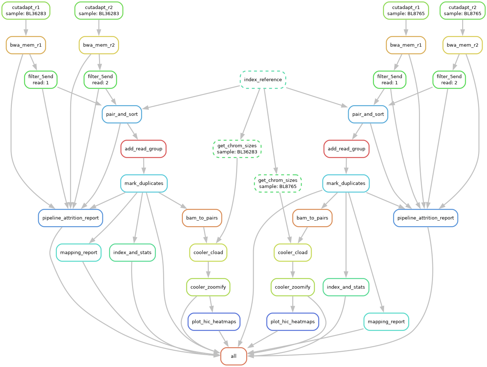
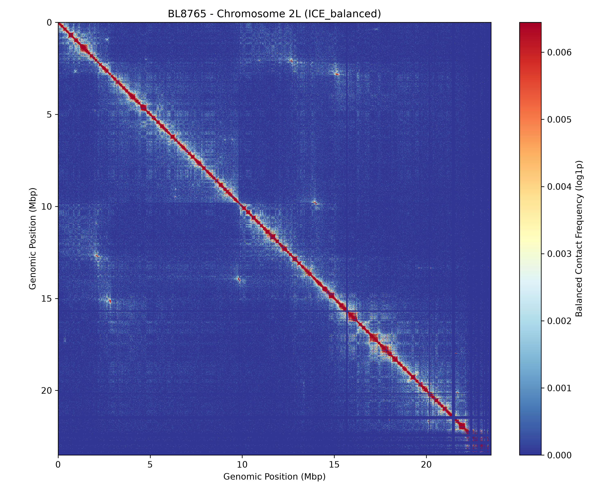
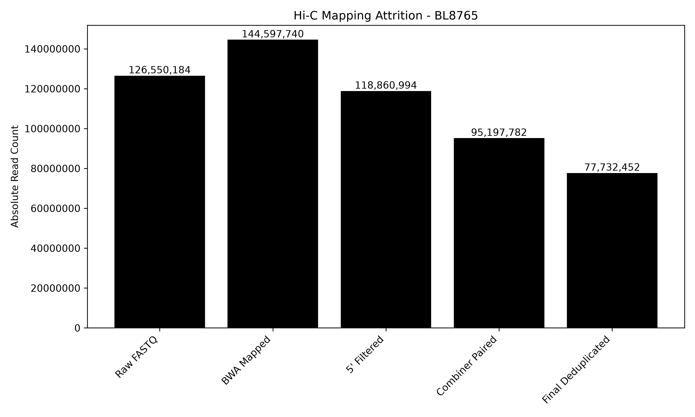

# Arima Hi-C Mapping Pipeline (Snakemake Implementation)

Mapping pipeline for data generated using Arima-HiC chemistry. 

We all love Arima Hi-C and we all love Snakemake, so let's set them up on a double date. This repository takes the official legacy Arima Genomics bash pipeline and modernizes it into a fully reproducible, scalable Snakemake workflow. 

It retains the strict, highly-validated 5' ligation filtering of the original Arima Perl scripts while updating the downstream matrix generation and visualization steps to use modern Python-based standards (`pairtools`, `cooler`, and `matplotlib`). See `Arima_Mapping_UserGuide.pdf (v03)` for a detailed write-up on the foundational Arima mapping logic.

# Quick Start

**1. Clone the repository**
```bash
git clone https://github.com/TDMillar-Biology/Arima_hic_mapping_snakemake
cd Arima_hic_mapping_snakemake
```

**2. Define your samples**

Edit config/samples.tsv to include your sample names and the absolute paths to their raw FASTQ files.

```
sample	fq1	fq2
BL8765	/path/to/BL8765_R1.fastq.gz	/path/to/BL8765_R2.fastq.gz
```

**3. Configure the workflow**

Open config/config.yaml to set your reference genome path, adjust memory limits, and tweak mapping parameters. The configuration file is heavily commented and split into standard user parameters versus system internals.

**4. Execute the pipeline**

The workflow utilizes Conda to automatically deploy isolated software environments (BWA-MEM2, Samtools, Picard, Cooler, etc.) for each rule.

```
snakemake --use-conda --cores 8
```

# Output Structure
For each sample processed, the pipeline generates a standardized output directory containing the alignments, interaction matrices, and QC metrics:

```
results/{sample}/
├── hic_mapped.bam               # Final, deduplicated BAM ready for downstream tools
├── hic_mapped.bam.bai
├── hic_10kb.cool                # Base contact matrix (10kb resolution)
├── hic.mcool                    # Multi-resolution cooler file with ICE balancing weights
├── heatmaps/                    # Static matplotlib visualizations
│   ├── hic_heatmap_WG_absolute.pdf
│   └── hic_heatmap_2L_ICE_balanced.pdf
└── reports/                     # QC and attrition metrics
    ├── mapping_report.txt
    └── pipeline_attrition.tsv
```

# Citations & Software Acknowledgements
If you use this pipeline in your research, check back ASAP for the pipeline citation, and dont forget to cite the tools below which all power the pipeline:

```
Snakemake: Mölder, F., Jablonski, K.P., Letcher, B., Hall, M.B., Tomkins-Tinch, C.H., Sochat, V., Forster, J., Lee, S., Twardziok, S.O., Kanitz, A., Wilm, A., Holtgrewe, M., Rahmann, S., Osterweil, S., & Köster, J. (2021). Sustainable data analysis with Snakemake. F1000Research, 10, 33.

BWA-MEM2: Vasimuddin Md, Misra, S., Li, H., & Aluru, S. (2019). Efficient Architecture-Aware Acceleration of BWA-MEM for Multicore Systems. IEEE International Parallel and Distributed Processing Symposium (IPDPS).

Pairtools: Open2C, Goloborodko, A., Bradley, J., Mach, P., Schalbetter, S., & Fudenberg, G. (2023). Pairtools: from sequencing data to chromosome contacts. bioRxiv.

Cooler: Abdennur, N., & Mirny, L. A. (2020). Cooler: scalable storage for Hi-C data and other genomically labeled arrays. Bioinformatics, 36(1), 311-316.

ICE Balancing: Imakaev, M., Fudenberg, G., McCord, R. P., Naumova, N., Goloborodko, A., Lajoie, B. R., Dekker, J., & Mirny, L. A. (2012). Iterative correction of Hi-C data reveals structural organization of the genome. Nature Methods, 9(10), 999-1003.

Samtools: Danecek, P., Bonfield, J. K., Liddle, J., Marshall, J., Ohan, V., Pollard, M. O., Whitwham, A., Keane, T., McCarthy, S. A., Davies, R. M., & Li, H. (2021). Twelve years of SAMtools and BCFtools. GigaScience, 10(2).

Cutadapt: Martin, M. (2011). Cutadapt removes adapter sequences from high-throughput sequencing reads. EMBnet.journal, 17(1), 10-12.

Picard: Broad Institute. Picard Tools. http://broadinstitute.github.io/picard/

Arima Genomics: The foundational Perl filtering scripts and mapping logic are derived from the official Arima Hi-C Mapping Pipeline.

```

# Pipeline DAG
An overview of the Snakemake execution graph.


# Contact Matrices
The pipeline automatically extracts and plots absolute and ICE-balanced contact frequency heatmaps directly from the .mcool files.


# Pipeline Attrition Analysis
A step-by-step breakdown of read filtering, from raw FASTQs to final deduplicated valid pairs. Highly useful for debugging library prep anomalies or mapping failures.
